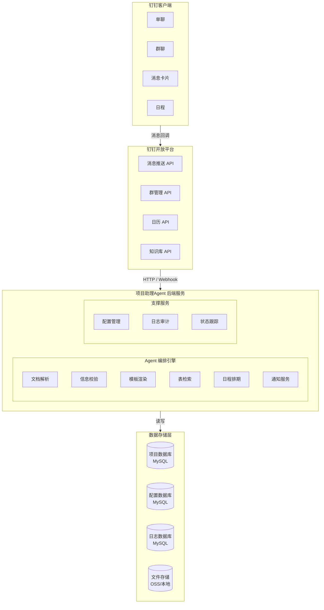
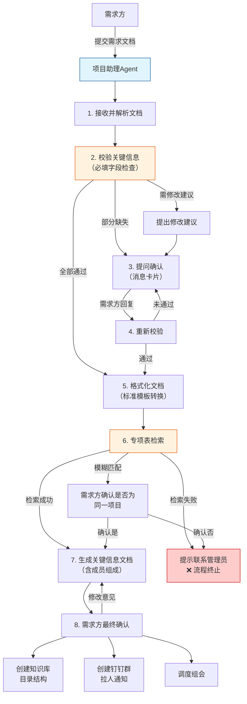
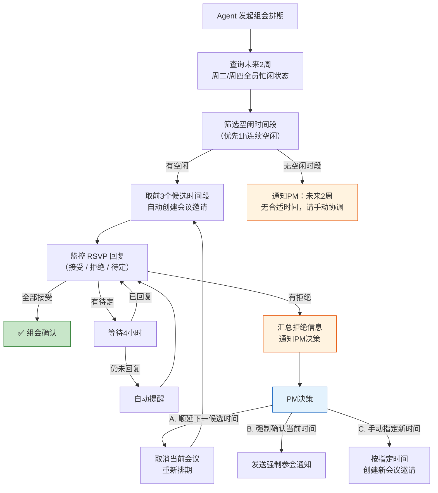

# 项目助理Agent（产研项目需求导入）\_PRD

# 产品需求文档（PRD）

## 项目助理Agent -- 智能项目立项与协同管理平台

| 文档信息 |  |
| --- | --- |
| 文档版本 | v1.1 |
| 创建日期 | 2026-06-08 |
| 作者 | 产品团队 |
| 状态 | 草案（Draft） |
| 目标受众 | 内部研发团队 |

**v1.1 更新说明**：根据实际截图更新知识库目录结构模板（3.2 US-08）。

---

## 1. 执行摘要（Executive Summary）

### 1.1 问题陈述

当前项目立项流程依赖人工操作，需求方提交的需求文档格式不统一、关键信息经常遗漏，项目经理需要反复沟通确认；知识库目录需要手动创建，钉钉群和参会人员需要逐个拉取，整个过程耗时且容易出错。一个中等规模项目的立项准备阶段平均耗时 2-3 个工作日，沟通成本占整体立项周期的 60% 以上。

### 1.2 解决方案

构建一个基于钉钉企业内部应用的**项目助理Agent**，实现项目立项全流程自动化：接收需求导入文档 → 校验关键信息 → 格式化处理 → 创建知识库结构 → 建立专项钉钉群 → 智能调度组会时间。通过 AI Agent 替代重复性人工操作，将立项周期压缩至小时级别。

### 1.3 成功标准（KPIs）

| 指标 | 目标值 | 衡量方式 |
| --- | --- | --- |
| 立项周期缩短 | ≤ 4 小时（含人工确认等待） | 从需求方提交到项目立项完成的端到端时长 |
| 信息完整性 | ≥ 95% 需求文档一次通过校验 | 无需人工补全即可完成立项的比例 |
| 知识库创建准确率 | 100% 符合标准目录结构 | 人工抽查验证 |
| 组会排期成功率 | ≥ 85% 首次排期即全员通过 | 首次排期无需调整的比例 |
| 人工介入次数 | 立项流程中 ≤ 2 次 | 项目经理平均确认/决策次数 |

---

## 2. 用户角色（User Personas）

| 角色 | 描述 | 核心诉求 |
| --- | --- | --- |
| **需求方** | 提交项目需求的业务人员 | 快速提交需求，减少反复沟通，及时了解项目进展 |
| **项目经理（PM）** | 项目整体负责人 | 减少重复性事务工作，聚焦项目规划和风险管理 |
| **技术负责人** | 项目技术方案的决策者 | 提前获取项目信息，参与关键决策 |
| **CTO** | 技术战略负责人 | 掌握项目全景，参与立项评审 |
| **项目助理Agent** | 自动化执行者（本系统） | 准确、高效地完成立项流程各环节 |

---

## 3. 用户故事与功能需求

### 3.1 模块一：需求导入与处理

#### US-01：需求方提交需求导入文档

**用户故事**：作为需求方，我希望通过钉钉向项目助理Agent提交需求导入文档，以便快速启动项目立项流程。

**验收标准**：

*   [ ] 需求方可在钉钉单聊/群聊中 @项目助理Agent 并上传需求文档（支持 .docx / .pdf / .md / 纯文本）
    
*   [ ] Agent 接收文档后，5 秒内回复确认收到，并告知预计处理时间
    
*   [ ] 支持需求方直接发送结构化文本（非文件）作为需求输入
    
*   [ ] 上传文件大小限制 ≤ 20MB
    

#### US-02：关键信息校验

**用户故事**：作为项目助理Agent，我需要在接收文档后自动检查关键信息是否完整，以便减少后续的人工确认环节。

补充：这里输出的PRD文档预期能够实现低保真原型和详细字段功能逻辑

**验收标准**：

*   [ ] 必填字段校验（缺一不可）：
    
*   ~~项目名称（Project Name）~~
    
*   子项目名称（Sub-project Name，~~若无则需明确标注"无"~~）
    
*   需求方姓名及部门
    
*   ~~需求描述（不少于 30 字）~~
    
*   ~~优先级（P0 紧急 / P1 高 / P2 中 / P3 低）~~
    
*   期望交付日期
    
*   [ ] 选填字段识别与提示：
    
*   关联项目/依赖项
    
*   ~~技术约束~~
    
*   ~~预算范围~~
    
*   ~~备注~~
    
*   [ ] 校验结果以结构化消息返回，标注每个字段的通过/缺失状态
    

#### US-03：需求文档格式化

**用户故事**：作为项目助理Agent，我需要将需求方提交的原始文档按照标准模板重新格式化，以便统一管理所有项目需求。

**验收标准**：

*   [ ] 自动提取原始文档中的关键字段，映射到标准模板对应位置
    
*   [ ] 标准模板包含以下章节：
    
*   项目基本信息（名称、编号、类型、优先级）
    
*   需求概述
    
*   范围与边界
    
*   验收标准
    
*   项目成员（初始为空，后续自动填充）
    
*   里程碑计划（初始为空）
    
*   附件与参考链接
    
*   [ ] 格式化后的文档保存为钉钉知识库文档格式，自动同步至对应项目目录
    
*   [ ] 保留原始文档作为附件挂载
    

#### US-04：遗漏信息确认

**用户故事**：作为项目助理Agent，我需要在发现信息遗漏时向需求方提问确认，以便在立项前补全所有必要信息。

**验收标准**：

*   [ ] 对每个缺失的必填字段生成一条明确的提问消息
    
*   [ ] 提问采用单选/多选/文本输入等交互式卡片形式（钉钉消息卡片）
    
*   [ ] 需求方可逐条回复或一次性批量补全
    
*   [ ] 所有必填字段补全后，Agent 方可进入下一环节
    
*   [ ] ~~若需求方 24 小时内未回复，Agent 自动提醒一次；48 小时未回复则标记为超时并通知项目经理~~
    

#### US-05：修改意见反馈

**用户故事**：作为项目助理Agent，我需要在处理需求文档时对不合理或可优化的内容提出修改建议，以便提升需求质量。

**验收标准**：

*   [ ] 可识别并提供修改建议的场景：
    
*   需求描述过于模糊（< 30 字）
    
*   期望交付日期早于当前日期
    
*   优先级与实际业务影响不匹配
    
*   与其他已知项目存在明显冲突
    
*   [ ] 修改建议以"建议项"而非"阻断项"呈现，需求方可选择接受或忽略
    
*   [ ] 建议记录在需求文档的修订历史中
    

#### US-06：专项表格检索与项目创建

**用户故事**：作为项目助理Agent，我需要在专项项目登记表中检索项目名称，若不存在则阻止立项并提示联系管理员。

**验收标准**：

*   [ ] 连接钉钉知识库中的专项项目登记表（智能表格/多维表）
    
*   [ ] 检索逻辑：
    
*   精确匹配项目名称
    
*   模糊匹配（相似度 ≥ 80%）给出提示，由需求方确认是否为同一项目
    
*   [ ] 匹配成功：从登记表中拉取项目编号、预算编码等基础信息
    
*   [ ] 匹配失败：返回"项目创建失败：项目名称未在专项登记表中找到，请联系管理员添加"，阻止后续流程
    
*   [ ] 每次检索记录日志（检索时间、关键词、结果）
    

#### US-07：自动生成项目关键信息文档

**用户故事**：作为项目助理Agent，我需要根据规则自动生成项目关键信息文档，包含成员组成等，以便快速建立项目的统一信息视图。

**验收标准**：

*   [ ] 自动生成文档包含：
    
*   项目基本信息（来自需求导入文档）
    
*   项目编号（来自专项登记表）
    
*   默认成员组成：
    
    *   项目经理：来自专项表格
        
    *   技术负责人：来自专项表格
        
    *   需求方：来自需求导入文档
        
    *   CTO：固定人员
        
*   项目状态：立项中
    
*   创建时间戳
    
*   [ ] 成员分配规则可配置（通过管理后台设置部门-人员映射表）
    
*   [ ] 生成后通知项目经理确认成员组成，项目经理可修改后确认
    

---

### 3.2 模块二：知识库管理

#### US-08：创建项目知识库结构

**用户故事**：作为项目助理Agent，我需要在项目立项后自动在钉钉知识库中创建项目文档及标准目录结构，以便团队快速上手使用。

**验收标准**：

*   [ ] 在钉钉知识库（阿里文档）指定空间下创建项目根文件夹，文件夹命名为：`[项目编号] 项目名称`
    
*   [ ] 自动创建标准目录结构：
    

```plaintext
[项目编号] 项目名称/
├── 项目文档/
│   ├── 验收表
│   ├── 参与度
│   ├── 时间节点
│   └── 质量评价表模板v3.0
├── 研发文档/
│   ├── 需求导入
│   └── 需求分解
└── 测试文档/
    ├── 测试报告
    └── 测试用例
```

*   [ ] ~~为每个文件夹设置默认权限：~~
    
*   ~~项目文档：项目全员可编辑~~
    
*   ~~研发文档：研发团队可编辑，全员可查看~~
    
*   ~~测试文档：测试团队可编辑，全员可查看~~
    
*   [ ] 创建完成后，向钉钉群发送知识库链接
    

---

### 3.3 模块三：钉钉群管理

#### US-09：创建专项钉钉群

**用户故事**：作为项目助理Agent，我需要在立项完成后自动创建专项钉钉群，拉入相关人员并发送项目基础信息。

**验收标准**：

*   [ ] 通过钉钉开放平台 API 自动创建群聊
    
*   [ ] 群命名规则：`【项目】项目名称`
    
*   [ ] 自动拉入人员：
    
*   需求方
    
*   项目经理
    
*   技术负责人
    
*   CTO
    
*   戴舒炜（勇气神喵）
    
*   项目助理Agent（机器人账号）
    
*   [ ] 所有人员入群后，Agent 自动发送群公告/置顶消息，包含：
    
*   项目名称~~、编号、优先级~~
    
*   项目成员及角色
    
*   知识库链接
    
*   首次组会时间（若已排定）
    
*   [ ] 若个别人员拉入失败（如未添加好友），Agent 记录失败原因并通知项目经理手动处理
    

---

### 3.4 模块四：组会调度

#### US-10：智能排期组会

**用户故事**：作为项目助理Agent，我需要根据必选人员的空闲时间智能排期组会，以便快速锁定首次项目会议时间。

**验收标准**：

*   [ ] 会议时间窗口：固定周二或周四
    
*   [ ] 必选参会人员（全部必选）：
    
*   需求方
    
*   项目经理
    
*   技术负责人
    
*   CTO
    
*   戴舒炜（勇气神喵）
    
*   [ ] 排期逻辑：
    

1.  通过钉钉日历 API 查询未来 2 周内所有周二、周四的必选人员忙闲状态
    
2.  筛选出全员空闲的时间段（优先 1 小时连续空闲）
    
3.  按时间最近优先排序，取前 3 个候选时间段
    
4.  自动创建会议邀请（钉钉日程），标题格式：`【项目立项组会】项目名称`
    
5.  将需求导入文档放入钉钉会议中
    

*   [ ] 会议时长默认 60 分钟
    

#### US-11：会议冲突处理

**用户故事**：作为项目助理Agent，我需要在必选人员拒绝会议邀请时，自动协调并通知项目经理决策。

**验收标准**：

*   [ ] 会议邀请发出后，监控 RSVP 状态（接受/拒绝/待定）
    
*   [ ] 若有必选人员拒绝：
    

1.  ~~收集拒绝人员及原因~~
    
2.  汇总为一条消息发送给项目经理，内容包含：被拒绝的会议时间、拒绝人~~、拒绝原因~~
    
3.  询问项目经理决策：A. 按规则顺延至下一个候选时间 / B. 忽略拒绝强制确认 / C. 手动指定时间
    

*   [ ] 根据项目经理决策执行：
    
*   选项 A：自动取消当前会议，重新排期下一个候选时间，重复 US-10 流程
    
*   选项 B：保留当前会议时间~~，向拒绝人发送强制参会通知~~
    
*   选项 C：按项目经理指定的时间创建新会议
    
*   [ ] 所有协调过程记录在项目会议纪要中
    
*   [ ] 超时处理：若项目经理 4 小时内未决策，Agent 再次提醒
    

---

## 4. 非目标（Non-Goals）

本期版本明确**不包含**以下功能：

*   项目执行阶段的进度跟踪与甘特图
    
*   需求变更管理流程
    
*   工时填报与统计
    
*   与 Jira / TAPD 等项目管理工具的集成
    
*   项目结项与归档流程
    
*   移动端独立应用（仅通过钉钉客户端使用）
    
*   多语言支持
    

---

## 5. 技术规格

### 5.1 架构概览



### 5.2 集成点

| 集成系统 | 接口/方式 | 用途 |
| --- | --- | --- |
| 钉钉开放平台 | 服务端 API + 事件订阅 | 消息收发、群管理、日程管理、知识库操作 |
| 钉钉知识库（阿里文档） | 钉钉开放平台文档 API | 创建/编辑文档、管理目录结构 |
| 钉钉专项登记表 | 钉钉智能表格 API | 检索项目名称、读取项目信息 |
| 钉钉日历 | 钉钉日程 API | 查询忙闲状态、创建/取消会议 |
| 钉钉消息卡片 | 钉钉卡片回调 | 交互式信息确认与决策 |

### 5.3 钉钉应用配置要求

| 权限项 | 用途 |
| --- | --- |
| `qyapi_chat_manage` | 群聊创建与管理 |
| `qyapi_calendar` | 日历查询与日程创建 |
| `qyapi_message` | 消息收发 |
| `qyapi_doc` | 知识库文档操作 |
| `qyapi_contact` | 通讯录读取（查询人员信息） |

### 5.4 数据模型概要

```plaintext
Project（项目表）
├── id (主键)
├── project_no (项目编号)
├── project_name (项目名称)
├── sub_project_name (子项目名称)
├── priority (优先级: P0/P1/P2/P3)
├── status (状态: 立项中/进行中/已结项)
├── description (需求描述)
├── expected_delivery_date (期望交付日期)
├── requester_id (需求方钉钉ID)
├── pm_id (项目经理钉钉ID)
├── tech_lead_id (技术负责人钉钉ID)
├── cto_id (CTO钉钉ID)
├── group_chat_id (钉钉群ID)
├── kb_folder_id (知识库根文件夹ID)
├── created_at
└── updated_at

RequirementDocument（需求文档表）
├── id
├── project_id (外键)
├── original_file_url (原始文档地址)
├── formatted_doc_id (格式化后文档ID)
├── validation_result (校验结果JSON)
├── status
└── created_at

Meeting（会议表）
├── id
├── project_id (外键)
├── dingtalk_event_id (钉钉日程ID)
├── scheduled_time
├── status (待确认/已确认/已取消/需调整)
├── candidate_slots (候选时间段JSON)
└── created_at

MemberAssignment（成员分配规则表）
├── id
├── department (部门名称)
├── pm_id (默认项目经理)
├── tech_lead_id (默认技术负责人)
├── priority (优先级)
└── is_active
```
---

## 6. 流程详解

### 6.1 需求导入完整流程图



### 6.2 组会调度流程


---

## 7. AI系统需求

### 7.1 核心AI能力

| 能力 | 描述 | 实现方式 |
| --- | --- | --- |
| 文档解析 | 从非结构化文档中提取关键字段 | NLP 实体识别 + 正则匹配 |
| 语义理解 | 理解需求描述的完整性和质量 | LLM 文本分析 |
| 智能提问 | 针对缺失信息生成清晰的追问 | LLM 生成 + 模板约束 |
| 修改建议 | 识别需求中的不合理之处 | 规则引擎 + LLM 辅助判断 |
| 模糊匹配 | 项目名称模糊匹配 | 编辑距离 + 语义向量相似度 |
| 排期优化 | 基于多人日历的智能排期 | 约束求解算法 |

### 7.2 评估策略

| 评估维度 | 方法 | 合格标准 |
| --- | --- | --- |
| 字段提取准确率 | 用100份历史需求文档测试 | 必填字段提取准确率 ≥ 95% |
| 提问质量 | 人工评审AI生成的追问 | 90%以上的提问被评审为"清晰且必要" |
| 修改建议采纳率 | 统计建议被需求方接受的比率 | ≥ 60% |
| 排期效率 | 对比人工排期耗时 | AI排期耗时 ≤ 人工排期的 20% |

---

## 8. 风险与路线图

### 8.1 技术风险

| 风险 | 影响 | 缓解措施 |
| --- | --- | --- |
| 钉钉API限流 | 批量操作时触发限流导致流程中断 | 实现请求队列 + 指数退避重试 |
| 文档格式多样性 | 非标准格式文档解析失败 | 先支持常见格式，异常时降级为人工处理 |
| 日历隐私限制 | 无法获取部分人员的忙闲信息 | 若日历查询失败，回退为该人员手动提供空闲时间 |
| 知识库API不稳定 | 目录创建失败 | 实现异步重试 + 失败告警通知管理员 |

### 8.2 分阶段实施计划

**Phase 1 -- MVP（4周）**

*   需求文档接收与解析
    
*   关键信息校验
    
*   遗漏信息提问确认
    
*   需求文档格式化
    
*   专项表检索
    

**Phase 2 -- 核心流程（3周）**

*   自动生成项目关键信息文档
    
*   知识库目录自动创建
    
*   钉钉群自动创建与人员拉取
    

**Phase 3 -- 智能排期（2周）**

*   组会智能排期
    
*   冲突处理与协调
    

**Phase 4 -- 优化迭代（持续）**

*   修改建议智能优化
    
*   成员分配规则配置后台
    
*   异常处理与监控面板
    

---

## 9. 附录

### 9.1 需求导入文档标准模板（通用版）[《\*\*\*\*\*\*\*\*需求导入文档》](https://alidocs.dingtalk.com/i/nodes/dpYLaezmVNL95ezRtGGbAA0l8rMqPxX6?utm_scene=team_space)

```markdown
# 项目需求导入文档

## 基本信息
| 字段 | 内容 |
|------|------|
| 项目名称 | [必填] |
| 子项目名称 | [必填/如无则填"无"] |
| 需求方 | [必填] 姓名 + 部门 |
| 优先级 | [必填] P0紧急 / P1高 / P2中 / P3低 |
| 期望交付日期 | [必填] YYYY-MM-DD |
| 关联项目 | [选填] |
| 技术约束 | [选填] |
| 预算范围 | [选填] |

## 需求概述
[必填，不少于30字]

## 范围与边界
- 包含范围：[必填]
- 不包含范围：[必填]

## 验收标准
1. [必填]
2. [必填]

## 备注
[选填]
```

### 9.2 专项项目登记表字段（通用版）

| 字段名 | 类型 | 说明 |
| --- | --- | --- |
| 项目编号 | 文本 | 唯一标识 |
| 项目名称 | 文本 | 用于检索匹配 |
| 所属部门 | 单选 |  |
| 项目类型 | 单选 | 内部/外部/合作 |
| 立项日期 | 日期 |  |
| 状态 | 单选 | 活跃/暂停/已结项 |

### 9.3 术语表

| 术语 | 说明 |
| --- | --- |
| 项目助理Agent | 本系统的核心，钉钉机器人形态的AI自动化助手 |
| 需求导入文档 | 需求方提交的初始需求描述文档 |
| 专项登记表 | 钉钉智能表格，存储所有已授权项目的登记信息 |
| RSVP | 会议邀请回复状态（Répondez s'il vous plaît） |
| 组会 | 项目立项评审/启动会 |

### 9.4 原始文档

[《项目助理agent——需求导入》](https://alidocs.dingtalk.com/i/nodes/ZgpG2NdyVXrGj3vRIGAKRQx08MwvDqPk?utm_scene=team_space&sideCollapsed=true&iframeQuery=utm_source%253Dportal%2526utm_medium%253Dportal_new_tab_open&corpId=dingca883cf037b3741435c2f4657eb6378f)