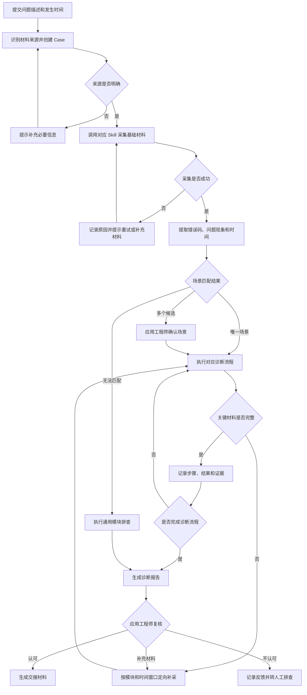
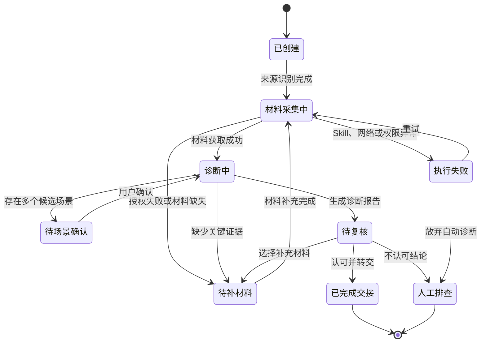

# Diagnosis-Agent V1 产品需求文档

## 目录

1. 项目概述
2. 用户、场景与产品范围
3. 产品方案
4. 功能需求
5. 系统边界与依赖
6. 测试与验收
7. 风险与迭代计划

> 本文档描述项目立项阶段的产品需求。当时 `management-system` 已具备基础平台能力，`jz_claude_skills` 已具备分散的原子 Skills，但尚未开发统一的 `diagnosis-orchestrator`。

## 1. 项目概述

### 1.1 背景与问题

应用工程师处理现场问题时，需要手动连接车辆、获取日志、查询错误码、检查配置并判断责任模块。排查过程依赖个人经验，处理顺序和交接质量不统一。

在 196 个导航相关问题中，错误码类 Bug 和五类高频问题共 89 个，约占 45%。这些问题具有重复特征和相对稳定的排查路径，适合通过 Agent 辅助完成问题初筛和模块归属判断。

### 1.2 已有能力与缺口

| 已有能力 | 代表能力 |
| --- | --- |
| 基础平台 | `management-system` 提供登录、权限和基础入口 |
| 材料采集 | 连接内网车辆、读取 Teambition、连接远程现场、读取已有日志 |
| 诊断分析 | 日志分析、设备诊断、任务引擎排查、机型配置检查 |
| 外部证据 | 查询钉钉文档和 GitLab 代码 |

已有 Skills 能够完成单点采集或分析，但缺少统一 Case、场景匹配、调用编排、证据记录和人工交接。本项目不重新开发底层工具，而是将已有能力组织成可执行、可追踪的诊断流程。

### 1.3 产品目标

- 自动组织已有 Skills，减少人工切换系统和重复获取材料；
- 按标准流程缩小问题范围，并尽可能收敛至责任模块；
- 输出可追溯的诊断证据和标准化交接材料；
- 材料不足或无法判断时明确降级，不强行输出确定结论。

## 2. 用户、场景与产品范围

### 2.1 目标用户

| 用户 | 核心诉求 |
| --- | --- |
| 应用工程师 | 快速完成问题初筛、缩小范围并判断责任模块 |
| 测试及现场实施人员 | 明确需要提交的材料，减少反复沟通 |
| 模块研发 | 获得包含现象、证据和已排除方向的交接材料 |

### 2.2 首期场景

1. **错误码类问题**：材料中存在明确错误码，需要结合日志、配置、版本和上下游状态判断触发原因及责任模块；
2. **高频现象类问题**：没有能够直接定位根因的错误码，但属于已沉淀的五类高频问题，可按标准流程逐项排查。

应用工程师输入问题描述和发生时间后，Agent 自动识别材料来源和诊断场景，完成材料获取和分步排查，再由应用工程师复核结果。

### 2.3 首期范围

| 范围项 | V1 定义 |
| --- | --- |
| 问题类型 | 错误码类问题、五类高频问题 |
| 材料入口 | Teambition 任务、内网车辆、客户远程现场、已有日志 |
| 核心能力 | 材料采集、场景匹配、流程执行、证据汇总、模块建议 |
| 最终输出 | 诊断结论、关键证据、已排除方向、缺失材料和下一步建议 |
| 人工节点 | 应用工程师复核，并决定补充材料、转交研发或继续人工排查 |

### 2.4 非目标

- 不处理所有类型的现场问题；
- 不替代模块研发完成根因定位、代码修改和 Bug 修复；
- 不将 Agent 输出直接作为最终责任判定；
- 不在未经人工确认时执行重启、配置修改或软件升级等高风险操作；
- 未匹配专项场景的问题只提供通用模块排查和人工排查线索。

## 3. 产品方案

### 3.1 Agent 诊断流程

### 3.2 Case 状态流转

### 3.3 全局产品规则

- 每个 Case 独立保存输入、材料、执行过程和结果；
- Agent 默认只读，高风险操作必须由人工确认；
- 事实证据与 Agent 判断分开展示，证据可追溯至原始材料；
- 材料不足或证据冲突时不得强行输出确定结论；
- 应用工程师拥有最终模块判断权，闭环指完成模块归属判断和交接，不代表 Bug 已修复。

## 4. 功能需求

### 4.1 创建 Case 与匹配场景

#### FR-01：创建诊断 Case 并识别材料来源

产品规则：

系统根据用户输入创建唯一 Case，并自动识别以下材料来源：

1. 内网车辆：车辆 IP、问题描述、发生时间；
2. Teambition 任务：TB 链接，系统自动提取问题描述和发生时间；
3. 客户远程现场：远程连接信息、车辆 IP、问题描述、发生时间；
4. 已有日志：日志目录、问题描述、发生时间。

验收标准：

- ☐ 系统能够识别四类材料来源并创建唯一 Case；
- ☐ 自动提取的信息向用户展示并允许修正；
- ☐ 信息缺失或来源无法识别时，明确提示需要补充的内容；
- ☐ Case 保存问题描述、发生时间、来源类型和来源地址。

#### FR-02：自动匹配诊断场景

产品规则：

系统根据问题描述、错误码、问题现象和关键特征匹配诊断流程。唯一匹配时自动执行；多个候选时由应用工程师确认；无法匹配时降级为通用模块排查，完成模块日志收集、摘要和关键线索呈现。

验收标准：

- ☐ 系统能够依据错误码知识和高频问题流程输出匹配结果；
- ☐ 唯一匹配、多候选和无法匹配三类结果均进入正确分支；
- ☐ 通用模块排查能够输出日志摘要和关键线索。

### 4.2 材料获取

#### FR-03：采集诊断材料

产品规则：

系统先按材料来源采集固定基础材料；诊断流程发现模块日志或时间窗口证据缺失时，再生成定向采集计划并补采。材料清单由可配置规则管理。

验收标准：

- ☐ 系统能够根据材料来源完成基础采集；
- ☐ 系统能够按模块和时间窗口定向补采；
- ☐ 页面展示材料清单、采集状态和失败原因；
- ☐ 需要额外授权时，必须获得用户确认。

### 4.3 诊断执行与证据

#### FR-04：执行标准诊断流程

产品规则：

每个诊断步骤包含检查对象、判断规则、所需证据和下一步动作。系统按顺序及分支执行；缺少关键材料时暂停并补采；无法继续时转人工排查。已完成步骤随 Case 保存并支持恢复。

验收标准：

- ☐ 系统能够按预设顺序和条件分支执行诊断步骤；
- ☐ 页面展示步骤状态和检查结果；
- ☐ 缺少关键材料时暂停诊断并提示缺失项；
- ☐ 重新进入 Case 后能够恢复已有进度。

#### FR-05：记录诊断证据

产品规则：

系统记录每个步骤的事实证据及 Agent 判断，并标明来源、时间、对应步骤以及支持或排除的诊断方向。

验收标准：

- ☐ 每个已执行步骤均展示结果和证据状态；
- ☐ 证据能够追溯至日志、配置、文档或代码原文；
- ☐ 系统区分事实证据与 Agent 判断；
- ☐ 缺少有效证据时标记为“证据不足”。

### 4.4 报告复核与交接

#### FR-06：生成诊断报告

产品规则：

系统汇总 Case 信息、诊断场景、执行步骤、建议模块、关键证据、已排除方向、缺失材料和下一步建议，生成可复核的诊断报告。

验收标准：

- ☐ 诊断结束后自动生成结构化报告；
- ☐ 报告中的证据能够追溯至原始材料；
- ☐ 未收敛时明确展示原因和下一步建议；
- ☐ 未经复核的建议不得标记为最终结论。

#### FR-07：复核并生成交接材料

产品规则：

应用工程师可以选择“认可结论”“补充材料”或“不认可结论”。认可后生成包含问题现象、材料、证据、已执行步骤、已排除方向和建议模块的交接材料；补充材料后继续原 Case；不认可时保存实际判断并转人工排查。

验收标准：

- ☐ 三类复核操作均能够正确更新 Case 状态；
- ☐ 认可后生成完整的标准化交接材料；
- ☐ 补充材料后能够继续原 Case；
- ☐ 系统记录复核人、时间和反馈内容。

## 5. 系统边界与依赖

| 系统层 | 职责 |
| --- | --- |
| `management-system` | 登录、权限、诊断入口、Case状态、报告查看和结果复核 |
| `diagnosis-orchestrator` | 维护上下文、识别来源和场景、编排 Skills、推进流程并汇总结论 |
| 原子 Skills | 完成车辆连接、材料读取、日志分析、配置检查、文档及代码查询 |
| 诊断知识 | 定义适用条件、所需材料、检查步骤、判断标准和下一步动作 |

## 6. 测试与验收

### 6.1 测试口径

| 项目 | 定义 |
| --- | --- |
| 测试集 | 从首期目标场景中筛选 50 个真实历史 Case，不代表全量随机样本 |
| 输入 | 保留原始问题描述、发生时间和当时可获得的材料 |
| 标准答案 | 以应用工程师最终确认的责任模块为准 |
| 特殊样本 | 材料不足的 Case 保留“材料不足”标记，不强设唯一模块 |
| 版本控制 | 使用固定版本的 Skills、诊断知识和系统环境 |

### 6.2 核心指标

| 指标 | 计算口径 | V1 灰度准入标准 |
| --- | --- | --- |
| 问题范围缩小率 | 至少排除一个候选方向的 Case 数 ÷ 测试 Case 数 | 记录辅助指标 |
| 模块归属收敛率 | 输出唯一模块且有证据支持的 Case 数 ÷ 测试 Case 数 | ≥ 80% |
| 已收敛 Case 判断准确率 | 人工复核正确数 ÷ 已收敛 Case 数 | ≥ 90% |
| 典型问题处理时间 | 有效输入到生成可复核报告的端到端时间 | 典型软件 Bug ≤ 10 分钟 |
| 证据有效率 | 人工认可的有效证据数 ÷ 输出证据总数 | 记录基线 |
| 高风险操作次数 | 未经确认执行高风险操作的次数 | 0 次 |

### 6.3 验收方法

1. 固定系统和知识版本运行 50 个 Case；
2. 记录场景匹配、材料采集、执行步骤、证据和模块建议；
3. 由应用工程师复核结论与证据；
4. 对未收敛、误判、材料不足和执行失败分别归因，指标达标后进入种子用户灰度。

实际数据和 Bad Case 分析单独记录在《Diagnosis-Agent：50 Case 测试记录》中。

## 7. 风险与迭代计划

### 7.1 主要风险

| 风险 | 产品应对 |
| --- | --- |
| 场景匹配错误 | 展示匹配依据；多候选时人工确认；允许修正 |
| 材料不完整 | 检查完整性；明确缺失项；证据不足时停止诊断 |
| 知识与版本不匹配 | 记录适用版本和维护人，版本不符时降低结论可信度 |
| Agent 推断缺少证据 | 区分事实与判断，无证据不得标记为确定结论 |
| Skill、网络或权限失败 | 保存状态和失败原因，支持恢复、重试及人工补充 |
| 高风险操作误执行 | 默认只读，高风险操作必须人工确认并保留审计记录 |

### 7.2 迭代计划

#### 阶段一：产品定义与 V1 建设

- 盘点已有平台和原子 Skills，完成 PRD、业务流程和交互原型；
- 建设 Case 上下文、场景路由、Skill 编排及管理平台接入；
- 沉淀错误码知识和五类高频问题诊断流程。

#### 阶段二：离线验收与灰度

- 使用 50 个真实历史 Case 完成离线验收；
- 根据误判、材料不足和执行失败修正规则；
- 指标达标后面向种子应用工程师灰度。

#### 阶段三：灰度后迭代

- 智能诊断继续聚焦高频问题、错误码和明确特征类问题；
- 其他问题降级为通用模块排查；
- 根据复核反馈持续更新诊断知识、流程和场景匹配规则。
