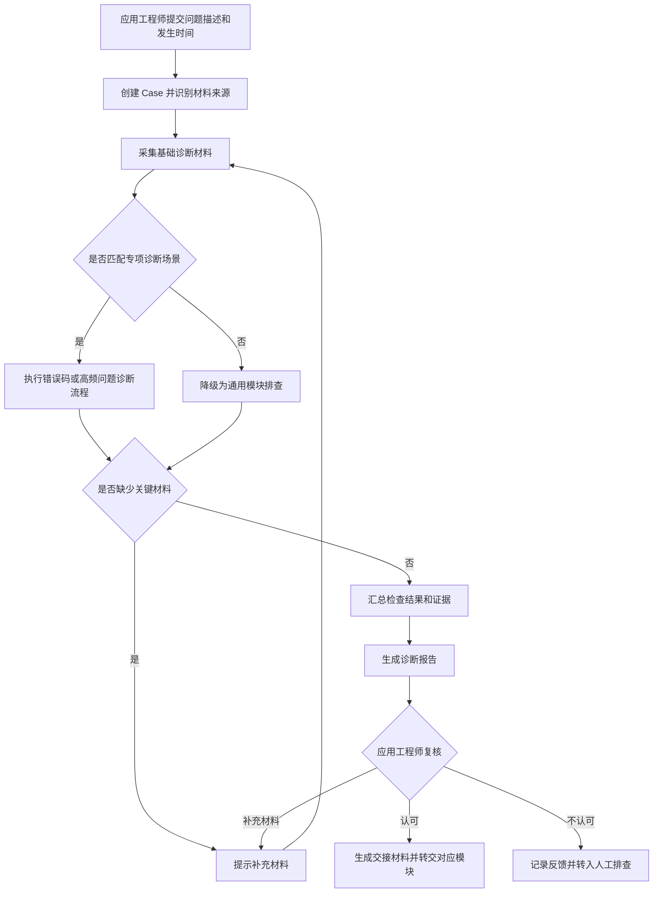
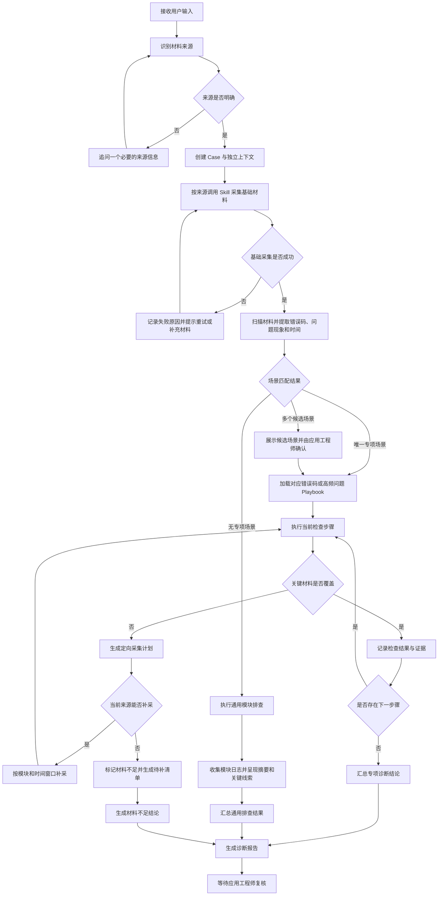
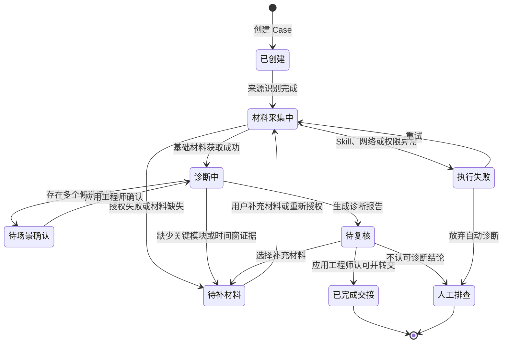

# Diagnosis-Agent V1 产品需求文档

## 目录

1. 项目背景与现状
   - 1.1 项目背景
   - 1.2 已有能力
   - 1.3 现有能力缺口
2. 目标用户与使用场景
3. 产品目标与范围
4. 产品方案与业务流程
5. 功能需求
6. 系统与职责边界
7. 测试与验收标准
8. 风险与迭代计划

> 本文档站在项目立项阶段描述产品需求。当时 `management-system` 已具备基础平台能力，`jz_claude_skills` 已具备分散的原子 Skills，但尚未开发统一的 `diagnosis-orchestrator`。

## 1. 项目背景与现状

### 1.1 项目背景

2026 年 3 月，在公司探索业务 AI 化机会的背景下，我结合现场问题复盘，发现应用工程师在接到现场问题后，需要手动获取日志、查询错误码、检查配置并判断问题归属模块。整个过程依赖个人经验，不同工程师的排查顺序和输出质量存在差异。

在 196 个导航相关问题中，错误码类 Bug 和五类高频问题合计 89 个，约占 45%。这些问题具有一定的重复性和相对稳定的排查路径，具备通过 AI 辅助诊断提升处理效率的机会。

### 1.2 已有能力

项目启动时，公司已经具备两类基础条件：

1. `management-system` 已提供用户登录、权限和基础平台，可以作为诊断产品的用户入口；
2. `jz_claude_skills` 已具备连接机器人、获取 Teambition 材料、下载日志、分析日志、检查机型配置以及查询钉钉文档和代码等原子能力。

以 `diagnosis-orchestrator` 首次提交前的仓库状态为基线，与诊断产品直接相关、且首次提交者不是 `wuhaoxian` 的 Skills 如下：

| Skill | 首次提交者 | 首次提交日期 | 已有能力 | 在 Diagnosis-Agent 中可承担的环节 |
| --- | --- | --- | --- | --- |
| `robot-peek` | zhan | 2026-03-30 | 连接公司内网机器人并读取运行信息 | 内网机器人材料采集 |
| `dingtalk-docs` | zhan | 2026-03-31 | 搜索和读取公司钉钉知识库 | 补充排查文档证据 |
| `remote-hand` | zhan | 2026-04-02 | 通过远程之手连接客户现场 | 远程现场材料采集 |
| `teambition` | zhan | 2026-04-09 | 读取 Teambition 任务及相关信息 | 获取问题描述、活动记录和附件 |
| `dingtalk-writer` | zhan | 2026-04-17 | 将 Markdown 内容发布到钉钉文档 | 经人工确认后沉淀诊断知识 |
| `gitlab-operator` | zhan | 2026-04-27 | 查询 GitLab 代码、提交和相关记录 | 补充代码与版本证据 |
| `robot-model-config` | zhan | 2026-04-30 | 查询和检查机器人机型配置 | 排查配置类问题 |
| `robot-diagnosis` | zhan | 2026-05-15 | 对机器人日志进行基础诊断和时间线分析 | 通用日志分析 |
| `device-log-analyzer` | kryoxygen | 2026-05-18 | 分析传感器、激光和相机等设备日志 | 设备类专项诊断 |
| `task-engine-troubleshoot` | ranyi | 2026-05-18 | 按 Playbook 排查任务引擎问题 | 任务链路专项诊断 |

上述 Skills 解决了单点数据获取或专项分析问题，但当时还缺少统一入口将它们按用户场景、材料状态和诊断步骤组织起来。

### 1.3 现有能力缺口

虽然单点能力已经存在，但尚未形成完整的诊断产品：

- 用户需要自行判断应该调用哪个 Skill；
- 不同 Skill 之间缺少统一调用顺序；
- 没有统一的 Case 上下文和材料完整性检查；
- 应用工程师排查经验没有转化为标准执行流程；
- 诊断过程和证据没有统一记录；
- 无法收敛时缺少标准化的人工交接；
- `management-system` 尚未形成面向应用工程师的完整诊断入口。

因此，本项目需要把分散的原子能力组织成一套统一、可执行、可追踪的诊断流程，而不是重新开发连接机器人或下载日志等底层工具。

## 2. 目标用户与使用场景

### 2.1 用户角色

| 用户角色 | 与产品的关系 | 核心诉求 |
| --- | --- | --- |
| 应用工程师 | 首期直接用户，发起诊断并复核结果 | 快速完成问题初筛、缩小原因范围并判断责任模块 |
| 测试及现场实施人员 | 问题和材料提供方 | 清楚需要提交哪些材料，减少与应用工程师的反复沟通 |
| 模块研发 | 诊断结果接收方 | 获得包含问题现象、关键证据和已排除方向的标准化交接材料 |

Agent 只提供辅助诊断。模块归属是否成立，以应用工程师的最终复核结果为准。

### 2.2 首期使用场景

首期选择具有相对稳定排查路径的两类问题：

1. **错误码类问题**：问题材料中存在明确错误码，需要结合日志、配置、版本和上下游状态判断触发原因及责任模块；
2. **高频现象类问题**：没有能够直接定位根因的错误码，但问题现象属于已沉淀的高频类型，可以按照标准排查流程逐项检查。

典型使用时机是：应用工程师收到现场问题后，输入问题描述和发生时间并发起诊断；Agent 自动识别材料来源和诊断场景，完成材料获取和分步排查，应用工程师复核结论后决定补充材料、继续人工排查或转交对应模块。

## 3. 产品目标与范围

### 3.1 产品目标

Diagnosis-Agent 首期目标是把应用工程师处理错误码和高频问题的经验，转化为可执行、可复核的标准诊断流程：

- 自动组织已有 Skills，减少人工切换系统和重复获取材料；
- 按统一排查步骤缩小问题范围，并尽可能收敛至责任模块；
- 记录检查过程和关键证据，提高转交研发时的信息质量；
- 在材料不足或无法判断时明确降级，不输出缺少依据的确定结论。

### 3.2 首期范围

| 范围项 | 首期定义 |
| --- | --- |
| 问题类型 | 错误码类问题、已沉淀标准流程的五类高频问题 |
| 材料入口 | Teambition 任务、公司内网机器人、客户远程现场、本地日志包 |
| 核心能力 | 材料检查与获取、问题特征识别、诊断流程匹配、分步检查、证据汇总、模块归属建议 |
| 最终输出 | 诊断结论、关键证据、已排除方向、材料缺失项和下一步建议 |
| 人工节点 | 应用工程师复核诊断结论，并决定补充材料、转交研发或继续人工排查 |

### 3.3 非目标

首期不包含以下内容：

- 不建设能够处理所有现场问题的通用诊断 Agent；
- 不替代模块研发完成具体根因定位、代码修改和 Bug 修复；
- 不将 Agent 输出直接视为最终责任判定；
- 不在未经人工确认的情况下执行重启、配置修改、软件升级等高风险操作；
- 不匹配首期专项场景的问题降级为通用模块排查，提供日志收集、摘要和关键线索；材料不足时提示补充材料或转人工处理。

## 4. 产品方案与业务流程

### 4.1 核心业务流程

### 4.2 Agent 诊断运行流程

### 4.3 Case 状态流转

### 4.4 关键节点说明

| 节点 | 用户操作 | 系统行为 | 输出或异常处理 |
| --- | --- | --- | --- |
| 发起诊断 | 提交问题描述、发生时间及已有的材料来源标识 | 创建独立 Case，自动识别材料来源 | 信息不足时提示补充必要内容 |
| 基础材料采集 | 按需完成授权或补充材料 | 按来源调用对应 Skill，只读采集最小必要材料 | 展示材料清单、采集状态及失败原因 |
| 场景匹配 | 多候选时确认诊断场景 | 匹配错误码或高频问题流程 | 无法匹配专项场景时降级为通用模块排查 |
| 执行诊断 | 按需补充关键材料 | 按标准流程逐项检查并记录证据 | 材料不足时暂停，不强行输出结论 |
| 生成报告 | 无 | 汇总结论、证据、已排除方向和缺失项 | 未收敛时明确说明原因和下一步建议 |
| 结果复核 | 认可、补充材料或不认可 | 保存复核结果并更新 Case 状态 | 补充后继续诊断；不认可则转人工排查 |
| 模块交接 | 确认转交 | 生成标准化交接材料 | 未经应用工程师认可不得标记为完成交接 |

## 5. 功能需求

### 5.1 模块一：创建 Case 与自动匹配场景

#### FR-01：创建诊断 Case 并识别材料来源

产品规则：

系统根据用户提交的信息自动识别材料来源，并创建独立诊断 Case。

1. 内网车辆：用户提供车辆 IP、问题描述和发生时间；
2. Teambition 任务：用户提供 TB 任务链接，系统从任务标题和背景描述中提取问题描述及发生时间，缺失时再向用户追问；
3. 客户远程现场：用户提供远程连接信息、现场机器人 IP、问题描述和发生时间；
4. 已有日志：用户提供系统可访问的日志目录、问题描述和发生时间。

验收标准：

- ☐ 输入符合要求后，系统创建唯一的诊断 Case；
- ☐ 系统能够自动识别内网车辆、TB 任务、客户远程现场或已有日志四类材料来源；
- ☐ 自动提取的信息需要展示给用户，并允许用户修正；
- ☐ 信息缺失或来源无法识别时，系统明确提示需要补充的内容；
- ☐ Case 创建后，保存问题描述、发生时间、材料来源及材料来源标识。

#### FR-02：自动匹配诊断场景

产品规则：

Case 创建并识别材料来源后，系统根据问题描述及已获取材料中的错误码、问题现象和关键特征，自动匹配对应的诊断流程。

1. 匹配结果唯一：自动进入对应诊断流程；
2. 存在多个候选场景：展示候选场景列表，由应用工程师确认；
3. 无法匹配：降级为通用模块排查。系统根据识别到的大模块调用已有的标准化排查 Skill，完成相关日志收集、日志摘要和关键线索呈现，由应用工程师继续判断。

验收标准：

- ☐ 系统能够根据已配置的错误码知识和高频问题流程，输出场景匹配结果；
- ☐ 匹配结果唯一时，系统自动进入对应诊断流程；
- ☐ 存在多个候选场景时，系统展示候选场景列表，并在应用工程师确认后进入对应流程；
- ☐ 无法匹配专项场景时，系统能够降级为通用模块排查；
- ☐ 降级后能够完成相关日志收集、日志摘要和关键线索呈现。

### 5.2 模块二：材料获取与完整性检查

#### FR-03：采集基础诊断材料

产品规则：

系统根据 Case 的材料来源调用对应 Skill，自动采集用于场景识别和初步分析的基础材料。采集过程遵循只读、最小必要和 Case 隔离原则；需要用户授权或超过自动处理限制的材料，必须经用户确认后获取。具体材料清单由可配置的采集规则管理。

验收标准：

- ☐ 系统能够根据材料来源执行对应的基础材料采集；
- ☐ 采集完成后展示材料清单及采集状态；
- ☐ 未经确认不得获取需要授权或超过自动处理限制的材料；
- ☐ 采集材料只关联至当前 Case；
- ☐ 采集失败时明确展示失败原因和下一步操作。

### 5.3 模块三：诊断执行与证据记录

#### FR-04：执行标准诊断流程

产品规则：

材料采集完成后，系统根据已匹配的错误码或高频问题诊断流程，按预设顺序执行检查步骤。

1. 每个检查步骤包含检查对象、判断规则、所需证据和下一步动作；
2. 当前步骤完成后，系统根据检查结果进入对应的下一步骤；
3. 缺少当前步骤所需材料时，系统暂停该步骤并提示补充材料，不得跳过关键检查；
4. 已完成的检查步骤保存至当前 Case，重新进入 Case 时不重复执行；
5. 无法继续执行或证据不足时，系统结束自动诊断并转由应用工程师处理。

验收标准：

- ☐ 系统能够加载并执行已匹配的标准诊断流程；
- ☐ 系统按照流程定义的顺序和分支执行检查步骤；
- ☐ 每个步骤能够展示执行状态和检查结果；
- ☐ 缺少关键材料时，系统暂停诊断并提示缺失内容；
- ☐ 重新进入 Case 后，系统能够恢复已有进度；
- ☐ 证据不足时，系统不得强行输出确定性结论。

#### FR-05：记录诊断证据

产品规则：

系统在执行每个诊断步骤时，同步记录检查结果及其证据。证据需要标明来源、发生时间、对应检查步骤和支持的判断方向，并能够追溯至原始材料。

1. 直接来自日志、状态、配置、错误码文档或代码的内容记录为事实证据；
2. Agent 基于事实证据形成的判断需要与原始证据分开展示；
3. 证据既可以用于支持候选结论，也可以用于排除候选方向；
4. 缺少有效证据的检查步骤标记为“证据不足”，不得记录为已确认结论；
5. 所有证据只关联至当前 Case，并随诊断过程一同保存。

验收标准：

- ☐ 每个已执行的诊断步骤均展示检查结果和对应证据状态；
- ☐ 证据能够追溯至原始日志、配置、文档或代码来源；
- ☐ 系统区分事实证据与 Agent 判断；
- ☐ 系统能够标明证据用于支持或排除哪个诊断方向；
- ☐ 缺少有效证据时，系统明确标记为“证据不足”；
- ☐ 不同 Case 之间的证据不得混用。

### 5.4 模块四：结果复核与人工交接

#### FR-06：生成诊断报告

产品规则：

诊断流程结束后，系统汇总 Case 信息、检查过程和证据，生成结构化诊断报告。报告用于帮助应用工程师复核和转交，不作为未经确认的最终责任判定。

诊断报告至少包含：

1. 问题描述、发生时间和材料来源；
2. 匹配的诊断场景及已执行步骤；
3. 建议归属模块和当前结论状态；
4. 支撑结论的关键证据及其原始来源；
5. 已排除的问题方向；
6. 缺失材料、未完成检查和下一步建议。

验收标准：

- ☐ 诊断流程结束后，系统自动生成当前 Case 的诊断报告；
- ☐ 报告完整展示建议归属模块、关键证据、已排除方向和下一步建议；
- ☐ 报告中的证据能够跳转或追溯至原始材料；
- ☐ 未收敛或材料不足时，报告明确展示当前状态和未完成原因；
- ☐ 报告不得将未经应用工程师复核的结论标记为最终结论。

#### FR-07：复核结果并生成人工交接材料

产品规则：

应用工程师查看诊断报告后，对建议归属模块进行复核，并选择“认可结论”“需要补充材料”或“不认可结论”。

1. 认可结论：系统记录复核结果，并生成面向对应模块研发的标准化交接材料；
2. 需要补充材料：系统记录缺失项，补充材料后从当前 Case 继续诊断；
3. 不认可结论：应用工程师填写实际判断或原因，系统保留反馈并转入人工排查；
4. 标准化交接材料包含问题现象、发生时间、材料清单、关键证据、已执行步骤、已排除方向和建议归属模块；
5. 应用工程师的复核结果作为后续测试评估和诊断规则迭代的依据。

验收标准：

- ☐ 应用工程师能够对诊断结论执行认可、补充材料或不认可操作；
- ☐ 认可结论后，系统能够生成包含完整上下文和证据的交接材料；
- ☐ 补充材料后，系统能够在原 Case 中继续诊断；
- ☐ 不认可结论时，系统能够保存应用工程师的实际判断和反馈原因；
- ☐ 所有复核操作均记录操作者和操作时间；
- ☐ 未经应用工程师认可的 Case 不得标记为已完成模块交接。

## 6. 系统与职责边界

### 6.1 系统分层

Diagnosis-Agent 不重新开发底层诊断工具，而是在已有平台和原子 Skills 之上增加统一的产品入口与诊断编排能力。

| 系统层 | 主要职责 | 项目关系 |
| --- | --- | --- |
| `management-system` | 提供用户登录、权限、诊断入口、Case 展示、过程状态和结果复核界面 | 已有基础平台，需要接入 Diagnosis-Agent 产品流程 |
| `diagnosis-orchestrator` | 维护 Case 上下文，识别材料来源和诊断场景，编排 Skills，推进诊断流程并汇总结论 | PRD 提出后的新增能力，由算法侧开发 |
| 原子 Skills | 完成机器人连接、TB材料读取、日志分析、配置检查、文档及代码查询等单点任务 | 项目启动时已有，按统一规范被编排调用 |
| 错误码知识与高频问题流程 | 定义适用条件、所需材料、检查步骤、判断标准和下一步动作 | 由领域研发和应用工程师提供专业内容，产品统一知识标准 |

### 6.2 团队职责

| 角色 | 主要职责 |
| --- | --- |
| 产品经理 | 分析历史问题和用户需求，盘点已有能力，定义首期范围、业务流程、功能规则、安全边界、原型、测试集和验收指标，并组织评审与灰度 |
| 算法同事 | 设计并开发 `diagnosis-orchestrator`，实现输入识别、场景路由、Skill 编排、Agent 推理和诊断流程执行 |
| 开发同事 | 完成 `management-system` 的前后端改造、权限接入、Case 状态管理、接口集成、运行环境和系统监控 |
| 领域研发 | 根据代码和技术机制编写或评审错误码知识、模块映射及专项诊断规则 |
| 应用工程师 | 提供真实排查流程和历史 Case，复核诊断结论，并作为模块归属标准答案的确认者 |

### 6.3 产品经理工作边界

产品经理主导的是产品业务流程和验收口径，包括用户输入、系统分支、输出形式、人工确认、异常降级和安全规则。算法和开发负责技术流程、底层工具及正式系统实现。

本项目中，产品经理通过 Vibe Coding 完成交互原型，用于验证用户流程和信息呈现；不将底层 Skills、`diagnosis-orchestrator` 或正式系统开发包装为产品经理个人开发成果。

## 7. 测试与验收标准

### 7.1 测试集构建

从首期能力范围内筛选 50 个真实历史 Case，覆盖错误码问题和五类高频问题。该测试集用于验证专项诊断能力，不代表从全部现场问题中随机抽样得到的全量效果。

测试集需要满足以下要求：

- 每个 Case 保留当时能够获得的原始问题描述、发生时间和诊断材料；
- 测试前隐藏历史处理结论，避免 Agent 直接读取标准答案；
- 以应用工程师最终确认的责任模块作为模块归属标准答案；
- 材料本身不足以判断的 Case 保留“材料不足”标记，不强行设置唯一模块；
- 测试过程记录输入、诊断路径、证据、输出结论、人工复核和处理时间。

### 7.2 核心指标

| 指标 | 计算口径 | V1 灰度准入标准 |
| --- | --- | --- |
| 问题范围缩小率 | 至少排除一个候选方向的 Case 数 ÷ 测试 Case 数 | 作为辅助指标记录，不替代模块归属结论 |
| 模块归属收敛率 | 输出唯一责任模块且具有证据支持的 Case 数 ÷ 测试 Case 数 | ≥ 80% |
| 已收敛 Case 判断准确率 | 经应用工程师复核正确的 Case 数 ÷ 已收敛 Case 数 | ≥ 90% |
| 典型问题处理时间 | 从提交有效输入到生成可复核报告的端到端时间 | 典型软件 Bug ≤ 10 分钟 |
| 证据有效率 | 经应用工程师认可、能够支持或排除诊断方向的证据数 ÷ 输出证据总数 | 记录基线，作为后续优化指标 |
| 高风险操作次数 | 未经人工确认执行重启、配置修改或软件升级等操作的次数 | 0 次 |

### 7.3 验收方法

1. 使用固定版本的 Skills、诊断知识和系统环境运行 50 个 Case；
2. 记录 Agent 的场景匹配、材料采集、检查步骤、证据和模块建议；
3. 由应用工程师逐项复核结论和证据，不以 Agent 自评作为验收结果；
4. 对未收敛、误判、材料不足和流程执行失败的 Case 分别归因；
5. 核心指标满足灰度准入标准且高风险操作为 0 次后，方可进入种子用户灰度。

实际灰度数据和 Bad Case 分析单独记录在《Diagnosis-Agent：50 Case 测试记录》中，避免将测试结果与 PRD 验收口径混写。

## 8. 风险与迭代计划

### 8.1 主要风险

| 风险 | 可能影响 | 产品应对 |
| --- | --- | --- |
| 场景匹配错误 | 调用错误诊断流程，输出无关结论 | 展示匹配依据；多候选时由应用工程师确认；允许修正并记录反馈 |
| 诊断材料不完整 | 无法覆盖关键检查步骤，导致错误收敛 | 检查材料完整性；明确缺失项；证据不足时停止诊断或转人工 |
| 诊断知识与版本不匹配 | 使用过期规则解释新版本问题 | 知识记录适用版本和维护人；版本不匹配时降低结论可信度 |
| Agent 推断缺少证据 | 产生无法复核或具有误导性的结论 | 区分事实证据和 Agent 判断；无证据不得标记为确定结论 |
| Skill、网络或权限失败 | 材料采集或诊断流程中断 | 保存 Case 状态和失败原因，支持恢复、重试及人工补充材料 |
| 高风险操作被误执行 | 影响现场设备运行或生产安全 | 默认只读；重启、配置修改和软件升级必须人工确认并记录审计日志 |
| 不同 Case 上下文混用 | 造成证据污染和错误判断 | 每个 Case 独立保存上下文、材料、执行过程和诊断结果 |
| 测试样本存在范围偏差 | 灰度指标无法代表全部现场问题 | 明确 50 个 Case 来自首期目标场景，不将结果外推为全量问题效果 |

### 8.2 迭代计划

#### 阶段一：产品定义与原型验证

- 盘点 `management-system` 和已有原子 Skills；
- 完成用户场景、业务流程、产品边界和 PRD；
- 通过 Vibe Coding 和 Claude + Skills 验证输入、诊断、降级及结果呈现流程。

#### 阶段二：V1 能力建设

- 由算法侧开发 `diagnosis-orchestrator`，完成 Case 上下文、场景路由和 Skill 编排；
- 沉淀错误码知识和五类高频问题诊断流程；
- 由开发侧完成 `management-system` 接入、状态展示、报告查看和人工复核能力。

#### 阶段三：离线验收与种子用户灰度

- 使用 50 个真实历史 Case 完成离线验收；
- 根据未收敛、误判、材料不足和执行失败等类型修正规则；
- 指标满足准入标准后，面向种子应用工程师开展灰度。

#### 阶段四：灰度后迭代

- 智能诊断继续聚焦高频问题、有错误码或具有明确特征的问题；
- 其他问题降级为通用模块排查，提供日志收集、摘要和关键线索；
- 持续根据应用工程师反馈更新错误码知识、诊断流程和场景匹配规则；
- 在诊断价值和稳定性得到验证后，再评估更复杂的工作流编排与系统化升级。
